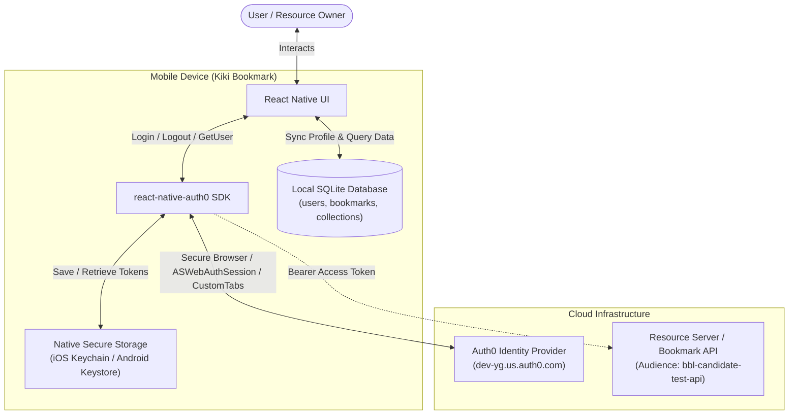
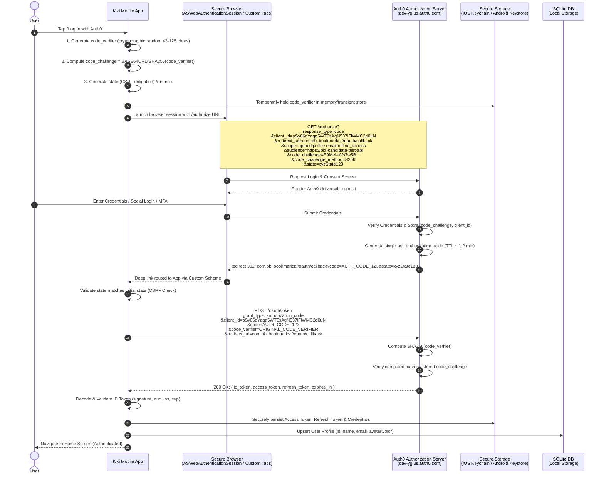
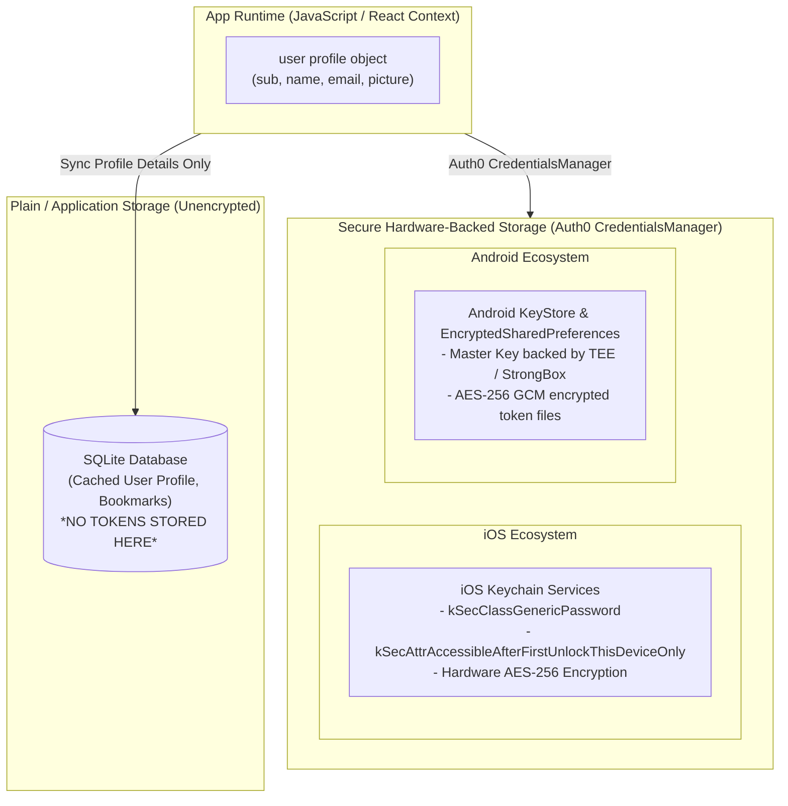
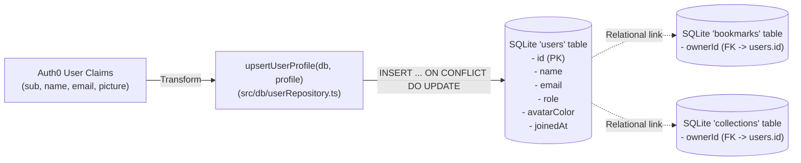

# Authentication & Authorization Architecture Design

This document details the authentication and authorization architecture for **Kiki Bookmark**, explaining OpenID Connect (OIDC) integration with Auth0, the complete mechanics of the Authorization Code Flow with Proof Key for Code Exchange (PKCE), and secure token storage in mobile environments.

---

## Table of Contents

1. [Architectural Overview](#1-architectural-overview)
2. [OIDC vs OAuth 2.0 Concepts](#2-oidc-vs-oauth-20-concepts)
3. [Why Authorization Code with PKCE?](#3-why-authorization-code-with-pkce)
4. [End-to-End Authentication Flow (Sequence Diagram)](#4-end-to-end-authentication-flow-sequence-diagram)
5. [Deep Dive: PKCE Mechanics & Cryptography](#5-deep-dive-pkce-mechanics--cryptography)
6. [Token Types, Lifecycles & Scopes](#6-token-types-lifecycles--scopes)
7. [Mobile Token Storage & Security Architecture](#7-mobile-token-storage--security-architecture)
8. [Local Database Synchronization (SQLite)](#8-local-database-synchronization-sqlite)
9. [Session Management, Refresh Tokens & Logout](#9-session-management-refresh-tokens--logout)
10. [Configuration & Reference Specs](#10-configuration--reference-specs)

---

## 1. Architectural Overview

Kiki Bookmark is a native mobile application built on **React Native (Expo SDK 57)** and uses **Auth0** as its centralized Identity Provider (IdP). The application acts as a **Public Client** under the OAuth 2.0 specification, communicating with:

* **Authorization Server (Auth0)**: Handles identity verification, authentication policies, social/database logins, and issues cryptographically signed tokens.
* **Resource Server (Backend API)**: Accepts and validates OAuth 2.0 Access Tokens for protected API operations.
* **Client Application (Kiki Bookmark)**: Native mobile client running on iOS and Android.
* **Local Data Layer (Expo SQLite)**: On-device database caching user profiles and bookmark collections.



---

## 2. OIDC vs OAuth 2.0 Concepts

While often used interchangeably, **OAuth 2.0** and **OpenID Connect (OIDC)** serve distinct but complementary purposes:

| Aspect | OAuth 2.0 (RFC 6749) | OpenID Connect (OIDC Core 1.0) |
| :--- | :--- | :--- |
| **Primary Goal** | **Authorization** (Delegated Access) | **Authentication** (Federated Identity) |
| **Question Answered**| *"What is this client permitted to access?"* | *"Who is the current user?"* |
| **Token Produced** | **Access Token** (opaque string or JWT) | **ID Token** (signed JWT containing identity claims) |
| **Usage** | Sent in `Authorization: Bearer <token>` header to Resource APIs | Consumed and verified by the Client to establish local user session |
| **Standard Endpoints** | `/authorize`, `/oauth/token`, `/oauth/revoke` | `/userinfo`, `/.well-known/openid-configuration`, `/.well-known/jwks.json` |

In Kiki Bookmark, **OIDC** provides the user's identity profile (name, email, unique `sub` ID, picture), while **OAuth 2.0** grants permissions (via `audience` and `scope`) to interact with backend bookmark services.

---

## 3. Why Authorization Code with PKCE?

### The Mobile Client Security Dilemma (Public Client)
Mobile applications are classified as **Public Clients** because client binaries can be decompiled, inspected, and reverse-engineered. Consequently:
* **No `client_secret` can be safely embedded** in the mobile app bundle.
* Traditional *Authorization Code Flow* relies on a `client_secret` during the token exchange to prove the client's identity.
* The legacy *Implicit Flow* (`response_type=token`) returned access tokens directly in the redirect URL fragment, exposing them to URL logging, browser history, and unauthorized app interception.

### The Authorization Code Interception Attack
On mobile operating systems (iOS / Android), apps register Custom URL schemes (e.g. `com.bbl.bookmarks://`). Multiple applications could theoretically register or intercept custom scheme redirects. If a malicious app intercepts the `authorization_code`, it could attempt to exchange it for tokens.

### How PKCE (RFC 7636) Resolves This
**Proof Key for Code Exchange (PKCE)** replaces static secrets with a dynamic, one-time cryptographic proof generated in memory for each login attempt:
1. The client creates a secret random string called the `code_verifier`.
2. The client calculates a SHA-256 hash called the `code_challenge` and sends *only the hash* with the initial login request.
3. When exchanging the authorization code, the client sends the original plaintext `code_verifier`.
4. Auth0 hashes the verifier and validates that it matches the stored challenge.
5. Even if an attacker intercepts the authorization code, **they cannot obtain tokens without the original `code_verifier`**, which never leaves the app's memory during the redirect.

---

## 4. End-to-End Authentication Flow (Sequence Diagram)

Below is the complete protocol sequence executed when a user logs in to Kiki Bookmark:



---

## 5. Deep Dive: PKCE Mechanics & Cryptography

### Step 1: Generating the `code_verifier`
The `code_verifier` is a high-entropy cryptographic random string using characters `[A-Z]`, `[a-z]`, `[0-9]`, `-`, `.`, `_`, `~`, with a minimum length of 43 characters and maximum of 128 characters (RFC 7636 Section 4.1).

$$\text{code\_verifier} \in [A\text{-}Z, a\text{-}z, 0\text{-}9, -, ., \_, \sim]^{43\dots128}$$

### Step 2: Creating the `code_challenge`
The client creates a SHA-256 hash of the ASCII representation of the `code_verifier`, then Base64-URL encodes the raw digest without padding:

$$\text{code\_challenge} = \text{Base64UrlEncode}\Big(\text{SHA-256}(\text{ASCII}(\text{code\_verifier}))\Big)$$

```typescript
// Conceptual Implementation of PKCE generation
import * as Crypto from 'expo-crypto';

// 1. Generate high-entropy verifier
const codeVerifier = generateRandomString(64); // 43-128 chars

// 2. SHA-256 digest + Base64-URL encoding
const hashBuffer = await Crypto.digestStringAsync(
  Crypto.CryptoDigestAlgorithm.SHA256,
  codeVerifier,
  { encoding: Crypto.CryptoEncoding.BASE64URL }
);
const codeChallenge = hashBuffer;
const codeChallengeMethod = 'S256';
```

> [!IMPORTANT]
> The `react-native-auth0` SDK automatically handles high-entropy random generation and SHA-256 transformation natively on iOS and Android under the hood using native crypto APIs (`SecRandomCopyBytes` / `SecureRandom`).

### Step 3: The `/authorize` Request Parameters
When `authorize()` is called in `LoginScreen.tsx`, the SDK builds the following request:

```http
GET /authorize HTTP/1.1
Host: dev-yg.us.auth0.com
Parameters:
  response_type         = code
  client_id             = pSy06qYaqa5WT6sAgN537lFlWMC2d0uN
  redirect_uri          = com.bbl.bookmarks://oauth/callback
  scope                 = openid profile email offline_access
  audience              = https://bbl-candidate-test-api
  code_challenge        = E9Mel-aVs7w5Bf_jPqJhvo1CzT5r2yM0s...
  code_challenge_method = S256
  state                 = 9d8c34f... (anti-CSRF random token)
```

### Step 4: The `/oauth/token` Back-Channel Exchange
Once redirected back to the app with the short-lived `authorization_code`, the app sends a direct HTTPS POST request to Auth0's token endpoint:

```http
POST /oauth/token HTTP/1.1
Host: dev-yg.us.auth0.com
Content-Type: application/x-www-form-urlencoded

grant_type    = authorization_code
&client_id    = pSy06qYaqa5WT6sAgN537lFlWMC2d0uN
&code         = SplxlOBeZQQYbYS6WxSbIA
&code_verifier= dBjftJeZ4CVP-mB92K27uhbUJU1p1r_wW1gFWFOEjXk
&redirect_uri = com.bbl.bookmarks://oauth/callback
```

Auth0 performs the cryptographic check:
$$\text{Base64UrlEncode}\Big(\text{SHA-256}(\text{code\_verifier})\Big) \stackrel{?}{=} \text{code\_challenge}$$

If valid, Auth0 responds with the token bundle:
```json
{
  "access_token": "eyJhbGciOiJSUzI1NiIs...",
  "id_token": "eyJhbGciOiJSUzI1NiIs...",
  "refresh_token": "gAAAAABk9y...",
  "scope": "openid profile email offline_access",
  "expires_in": 86400,
  "token_type": "Bearer"
}
```

---

## 6. Token Types, Lifecycles & Scopes

### 1. ID Token (`id_token`)
* **Format**: JSON Web Token (JWT) signed by Auth0 using RS256 (asymmetric RSA signature verified via JWKS).
* **Purpose**: Carries verified identity information about the authenticated user to the mobile client.
* **Claims**:
  * `sub`: Unique Subject identifier for the user (e.g., `auth0|64df91a...` or `google-oauth2|10928...`).
  * `name`, `nickname`, `email`, `picture`: Profile metadata.
  * `iss`: Issuer identifier (`https://dev-yg.us.auth0.com/`).
  * `aud`: Target audience (must match our `clientId`).
  * `exp` & `iat`: Expiration and issued-at timestamps.

### 2. Access Token (`access_token`)
* **Format**: Signed JWT (when `audience` is supplied) or opaque string.
* **Purpose**: Authorization credential presented in HTTP `Authorization: Bearer <token>` headers when making calls to backend APIs.
* **Lifetime**: Short-lived (typically 1 hour to 24 hours).

### 3. Refresh Token (`refresh_token`)
* **Format**: Opaque high-entropy credential.
* **Purpose**: Used to obtain new Access and ID tokens silently when they expire, without requiring user re-authentication.
* **Granted by**: Requested via the `offline_access` scope.
* **Security**: Protected by **Refresh Token Rotation (RTR)** — each time a refresh token is used, Auth0 invalidates it and issues a new refresh token. If an invalidated refresh token is reused, Auth0 treats it as a breach and revokes all downstream tokens for that session.

---

## 7. Mobile Token Storage & Security Architecture

Storing authentication tokens on mobile devices requires hardware-backed encryption to prevent extraction via file system access or malicious debugging tools.



### Storage Breakdown by Platform

| Target | Platform Storage Mechanism | Security Level | Data Stored |
| :--- | :--- | :--- | :--- |
| **Refresh & Access Tokens** | **iOS Keychain** (`kSecClassGenericPassword`) | **Highest** (Hardware Secure Enclave, sandbox isolated) | `access_token`, `refresh_token`, `id_token` |
| **Refresh & Access Tokens** | **Android KeyStore** + `EncryptedSharedPreferences` | **Highest** (Hardware TEE / StrongBox key management) | `access_token`, `refresh_token`, `id_token` |
| **User Identity & Bookmarks**| **Expo SQLite** (`users`, `bookmarks`, `collections`) | **Application Sandbox** (Standard OS sandbox) | User display info (`id`, `name`, `email`, `role`), bookmarks |

> [!CAUTION]
> **Never store raw Access Tokens or Refresh Tokens in `AsyncStorage` or unencrypted SQLite tables.** `AsyncStorage` writes plain unencrypted JSON files on the device filesystem, making tokens susceptible to extraction on rooted/jailbroken devices or via backup archives.

---

## 8. Local Database Synchronization (SQLite)

When authentication completes, Kiki Bookmark syncs non-sensitive identity metadata from the Auth0 user object to the local SQLite database to support offline functionality, relational queries, and ownership filtering.



### Upsert Query Pattern (`src/db/userRepository.ts`)
```sql
INSERT INTO users (id, name, email, role, avatarColor, joinedAt)
VALUES (?, ?, ?, ?, ?, ?)
ON CONFLICT(id) DO UPDATE SET
  name = excluded.name,
  email = excluded.email,
  role = excluded.role,
  avatarColor = excluded.avatarColor;
```

---

## 9. Session Management, Refresh Tokens & Logout

### Silent Token Retrieval & Session Hydration
On app startup, the `Auth0Provider` initializes and automatically checks native secure storage for valid credentials.

```typescript
// To retrieve a fresh access token for backend requests:
const { getCredentials } = useAuth0();

const makeAuthenticatedRequest = async () => {
  // getCredentials() automatically uses the refresh_token if the access_token has expired
  const credentials = await getCredentials();
  const token = credentials?.accessToken;
  
  return fetch('https://api.example.com/bookmarks', {
    headers: {
      Authorization: `Bearer ${token}`,
    },
  });
};
```

### Logout Flow & Session Revocation
When a user logs out (`clearSession` in `ProfileScreen.tsx`):
1. **Local Cleanup**: The SDK removes all stored tokens from the iOS Keychain / Android KeyStore.
2. **Identity Provider Single Logout (SLO)**: A request is sent to `https://dev-yg.us.auth0.com/v2/logout` with `returnToUrl` to invalidate the Auth0 SSO browser session cookie.
3. **State Transition**: The `user` object in `useAuth0()` resets to `null`, causing `RootNavigator` to switch from authenticated screens back to `LoginScreen`.

---

## 10. Configuration & Reference Specs

### Kiki Bookmark Configuration Settings (`src/auth/config.ts`)

```typescript
export const AUTH0_CONFIG = {
  domain: 'dev-yg.us.auth0.com',
  clientId: 'pSy06qYaqa5WT6sAgN537lFlWMC2d0uN',
  discoveryEndpoint: 'https://dev-yg.us.auth0.com/.well-known/openid-configuration',
  bundleId: 'com.bbl.bookmarks',
  customScheme: 'com.bbl.bookmarks',
  redirectUri: 'com.bbl.bookmarks://oauth/callback',
  logoutUri: 'com.bbl.bookmarks://oauth/callback',
  scope: 'openid profile email offline_access',
  audience: 'https://bbl-candidate-test-api',
} as const;
```

### Relevant Specifications & RFCs
* **RFC 6749**: [The OAuth 2.0 Authorization Framework](https://datatracker.ietf.org/doc/html/rfc6749)
* **RFC 7636**: [Proof Key for Code Exchange by OAuth Public Clients (PKCE)](https://datatracker.ietf.org/doc/html/rfc7636)
* **RFC 8252**: [OAuth 2.0 for Native Apps (Best Current Practice)](https://datatracker.ietf.org/doc/html/rfc8252)
* **OpenID Connect Core 1.0**: [OpenID Connect Core Specification](https://openid.net/specs/openid-connect-core-1_0.html)
* **Auth0 React Native SDK**: [`react-native-auth0` Documentation](https://github.com/auth0/react-native-auth0)
