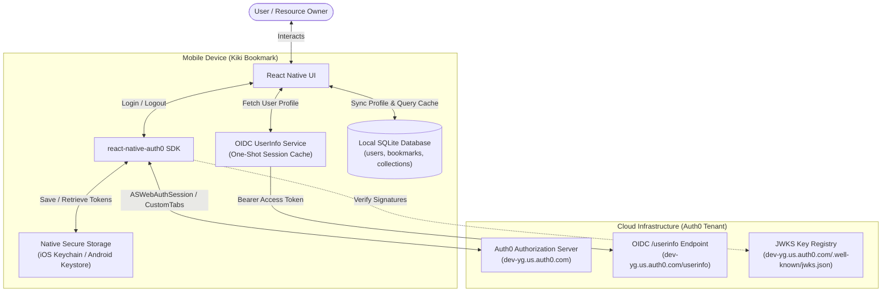
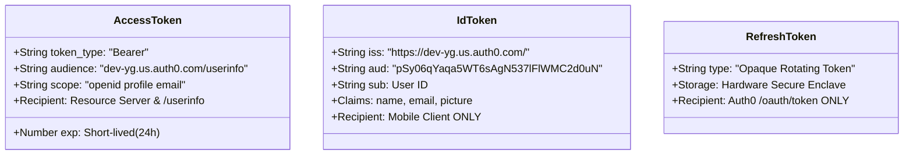
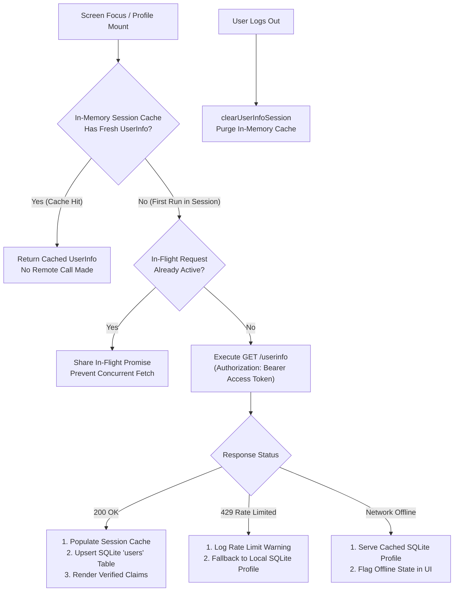
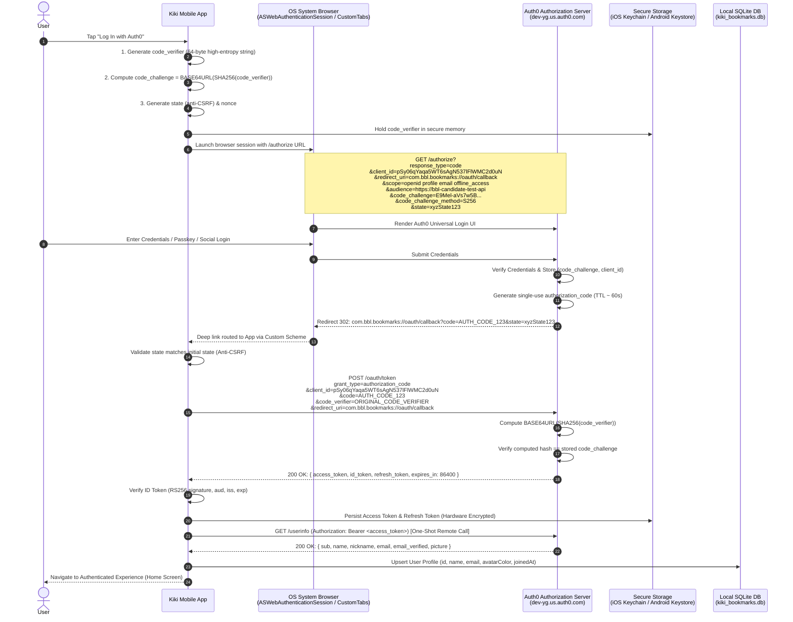
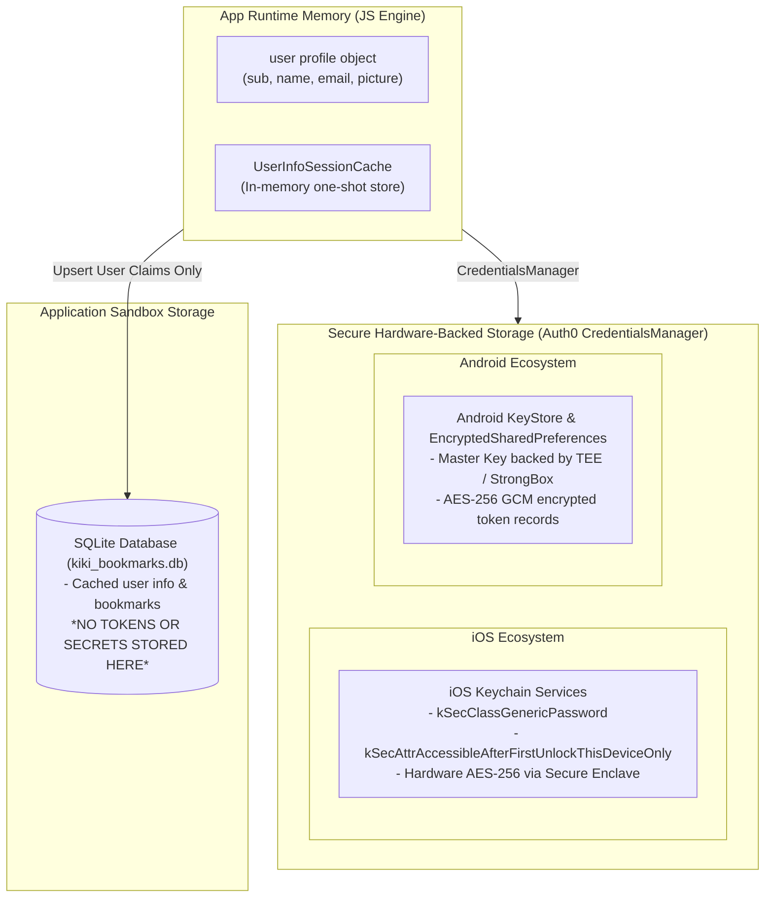

# Authentication & Authorization Architecture Design

This document details the authentication and authorization architecture for **Kiki Bookmark**, explaining OpenID Connect (OIDC) integration with Auth0, the complete mechanics of the Authorization Code Flow with Proof Key for Code Exchange (PKCE), secure token storage in mobile environments, session lifecycle management, and tenant discovery verification.

---

## Table of Contents

1. [Architectural Overview](#1-architectural-overview)
2. [IETF Best Current Practice for Native Apps (RFC 8252 / BCP 212)](#2-ietf-best-current-practice-for-native-apps-rfc-8252--bcp-212)
3. [Decision: Credential for Remote Calls & Security Trade-Offs](#3-decision-credential-for-remote-calls--security-trade-offs)
4. [Tenant Discovery Document & JWKS Cryptographic Audit](#4-tenant-discovery-document--jwks-cryptographic-audit)
5. [The Remote Call: GET /userinfo & Rate-Limiting Policy](#5-the-remote-call-get-userinfo--rate-limiting-policy)
6. [Session Lifecycle & Offline Resilience Matrix](#6-session-lifecycle--offline-resilience-matrix)
7. [End-to-End Authentication Protocol Flow (Sequence Diagram)](#7-end-to-end-authentication-protocol-flow-sequence-diagram)
8. [Deep Dive: PKCE Mechanics & Cryptographic Proof](#8-deep-dive-pkce-mechanics--cryptographic-proof)
9. [Token Types, Lifecycles & Scopes](#9-token-types-lifecycles--scopes)
10. [Mobile Token Storage & Hardware Security Architecture](#10-mobile-token-storage--hardware-security-architecture)
11. [Local Database Synchronization (SQLite)](#11-local-database-synchronization-sqlite)
12. [Configuration Settings & Reference Specifications](#12-configuration-settings--reference-specifications)

---

## 1. Architectural Overview

Kiki Bookmark is a native mobile application built on **React Native (Expo SDK 57)** and uses **Auth0** as its centralized Identity Provider (IdP). The application acts as a **Public Client** under the OAuth 2.0 specification, communicating with:

* **Authorization Server (Auth0)**: Handles identity verification, authentication policies, social/database logins, and issues cryptographically signed tokens (`dev-yg.us.auth0.com`).
* **Resource Server (Backend API / UserInfo)**: Accepts and validates OAuth 2.0 Access Tokens for protected operations and profile queries (`/userinfo` endpoint).
* **Client Application (Kiki Bookmark)**: Native mobile client running on iOS and Android.
* **Local Data Layer (Expo SQLite)**: On-device database caching user profiles, bookmarks, and collections for offline resilience.



---

## 2. IETF Best Current Practice for Native Apps (RFC 8252 / BCP 212)

### Citation & Standard
Kiki Bookmark strictly adheres to **[RFC 8252](https://datatracker.ietf.org/doc/html/rfc8252) (BCP 212) — *OAuth 2.0 for Native Apps*** and **[RFC 7636](https://datatracker.ietf.org/doc/html/rfc7636) (*Proof Key for Code Exchange by OAuth Public Clients*)**.

### The Vulnerability in Popular React Native Login Tutorials
Many popular React Native tutorials instruct developers to use embedded WebViews (e.g. `<WebView source={{ uri: authUrl }} />`) for authentication. **This is an anti-pattern explicitly prohibited by RFC 8252 Section 8.12.**

```
       INSECURE (Tutorial Pattern)                  SECURE (RFC 8252 BCP 212 Pattern)
  ┌─────────────────────────────────┐        ┌─────────────────────────────────────────┐
  │     Host Mobile Application     │        │         Host Mobile Application         │
  │  ┌───────────────────────────┐  │        │  ┌───────────────────┐                  │
  │  │    Embedded <WebView>     │  │        │  │  react-native-    │                  │
  │  │  (App has full DOM/JS     │  │        │  │  auth0 SDK        │                  │
  │  │   access to passwords!)   │  │        │  └─────────┬─────────┘                  │
  │  └───────────────────────────┘  │        └────────────┼────────────────────────────┘
  └─────────────────────────────────┘                     │ Secure IPC
                                                          ▼
                                             ┌─────────────────────────────────────────┐
                                             │ Isolated OS System Browser Sandbox      │
                                             │ (ASWebAuthenticationSession /           │
                                             │  Android Custom Tabs)                   │
                                             │  • App CANNOT inspect DOM or keys       │
                                             │  • Shared SSO cookies with Safari/Chrome│
                                             │  • Native Passkeys / WebAuthn / FaceID  │
                                             └─────────────────────────────────────────┘
```

### What RFC 8252 / BCP 212 Protects Against:
1. **Credential Harvesting & Keylogging**: In an embedded WebView, the hosting app (or any compromised third-party SDK/analytics library linked into the app bundle) has full access to the Document Object Model (DOM). It can attach JavaScript mutation observers and keydown listeners to harvest plaintext user passwords and multi-factor codes. RFC 8252 mandates an external system browser (`ASWebAuthenticationSession` on iOS, `CustomTabs` on Android), running in an isolated OS process where the host app has zero memory or DOM visibility.
2. **Session Cookie Theft**: Embedded WebViews run in the app's private cookie jar. Malicious code inside the app can extract session cookies. System browsers isolate cookies in the OS browser sandbox.
3. **Single Sign-On (SSO) & Biometric/Passkey Enablement**: System browsers share session state with the platform browser (Safari/Chrome). If the user is already logged in on the device, they authenticate with zero keystrokes. System browsers also natively support WebAuthn, FIDO2 hardware keys, and OS Passkeys/FaceID, which embedded WebViews break.
4. **Authorization Code Interception**: Mobile apps register custom URI schemes (e.g., `com.bbl.bookmarks://`). Multiple apps can claim the same scheme. RFC 8252 + RFC 7636 (PKCE) guarantees that even if an attacker intercepts the redirected `authorization_code`, they cannot exchange it for tokens without the cryptographically protected `code_verifier` held in private app memory.

---

## 3. Decision: Credential for Remote Calls & Security Trade-Offs

### Formal Decision Statement
* **Chosen Remote Credential**: **Access Token (`access_token`)**
* **One-Line Rationale**:
  > *"The Access Token is treated as the sole credential for remote calls because it is audience-bound and cryptographically scoped for resource server authorization (including the OIDC `/userinfo` endpoint), whereas ID Tokens are client-facing identity assertions not authorized for remote API delegation."*

### In-Depth Security Defense & Trade-Off Matrix



#### 1. Access Token vs. ID Token Trade-Offs
* **Audience Containment (RFC 6749 Section 1.4 vs. OIDC Core 1.0 Section 2)**:
  * The **ID Token**'s audience claim (`aud`) is strictly bound to the **Client ID** (`pSy06qYaqa5WT6sAgN537lFlWMC2d0uN`). Its purpose is to prove *to the mobile app* that the user authenticated. Sending an ID Token to a remote API breaks audience containment and violates the OIDC specification.
  * The **Access Token** is specifically minted for the target **Audience** (e.g., `https://dev-yg.us.auth0.com/userinfo` or backend resource servers). Resource servers validate that the token's audience matches their own identifier.
* **Information Leakage**: ID tokens contain user claims (`name`, `email`, `email_verified`, `picture`). Passing ID tokens in HTTP headers to multiple downstream microservices leaks personal identifiable information (PII) unnecessarily across network boundaries.

#### 2. Access Token vs. Refresh Token Trade-Offs
* **Exposure Minimization & Blast Radius**:
  * Access tokens have a short Time-to-Live (TTL = 86400s / 24 hours). If intercepted over the wire, an attacker's window of opportunity is limited.
  * Refresh tokens are long-lived credentials. They are **never transmitted to remote resource servers or the `/userinfo` endpoint**. They are strictly restricted to communication with Auth0's `/oauth/token` endpoint and stored in hardware-backed storage (iOS Keychain / Android KeyStore).

#### 3. Cryptographic Verification: Stateless RS256 JWT vs. Endpoint Verification
* The `/userinfo` endpoint directly validates the Bearer Access Token against Auth0's session registry.
* For backend APIs, the Access Token is verified statelessly against the tenant's public JWKS (`RS256`), eliminating database roundtrips on every request while maintaining cryptographic integrity.

---

## 4. Tenant Discovery Document & JWKS Cryptographic Audit

Before committing to the architectural design, the tenant's OpenID Connect Discovery Document (`/.well-known/openid-configuration`) and JSON Web Key Set (`/.well-known/jwks.json`) were queried and verified live against `https://dev-yg.us.auth0.com`.

### Discovery Document Verification Summary

```json
// GET https://dev-yg.us.auth0.com/.well-known/openid-configuration
{
  "issuer": "https://dev-yg.us.auth0.com/",
  "authorization_endpoint": "https://dev-yg.us.auth0.com/authorize",
  "token_endpoint": "https://dev-yg.us.auth0.com/oauth/token",
  "userinfo_endpoint": "https://dev-yg.us.auth0.com/userinfo",
  "jwks_uri": "https://dev-yg.us.auth0.com/.well-known/jwks.json",
  "revocation_endpoint": "https://dev-yg.us.auth0.com/oauth/revoke",
  "scopes_supported": ["openid", "profile", "offline_access", "name", "given_name", "family_name", "nickname", "email", "email_verified", "picture", "created_at", "identities", "phone", "address"],
  "response_types_supported": ["code", "token", "id_token", "code token", "code id_token", "token id_token", "code token id_token"],
  "code_challenge_methods_supported": ["S256", "plain"],
  "token_endpoint_auth_signing_alg_values_supported": ["RS256", "RS384", "PS256"],
  "id_token_signing_alg_values_supported": ["HS256", "RS256", "PS256"],
  "dpop_signing_alg_values_supported": ["ES256"],
  "grant_types_supported": ["client_credentials", "authorization_code", "refresh_token", "password", "implicit", "urn:ietf:params:oauth:grant-type:device_code"],
  "request_uri_parameter_supported": false,
  "request_parameter_supported": false
}
```

### Architectural Reasoning on Tenant Capabilities

| Feature / Parameter | Tenant Capability | Architectural Decision & Justification |
| :--- | :--- | :--- |
| **Grant Types** | Supports `authorization_code`, `refresh_token`, `implicit`, `client_credentials`, `password`, `device_code` | **Selected `authorization_code` + `refresh_token`.** `implicit` is available on the tenant for legacy web clients but strictly rejected for our mobile client. `password` (ROPC) is rejected to prevent credential handling. |
| **PKCE Methods** | Supports `["S256", "plain"]` | **Strictly enforced `S256`.** The `plain` method is prohibited because it does not protect against eavesdropping on the initial authorize request. |
| **Signing Algorithms** | Supports `["RS256", "HS256", "PS256"]` | **Selected `RS256` (Asymmetric RSA-SHA256).** `HS256` is symmetric and would require embedding a shared secret in the mobile client binary (fatal vulnerability for public clients). `RS256` allows public key verification via JWKS. |
| **JWKS Keys** | 2 Active RSA 2048-bit keys: `tOu0FHcN3C2etrel4Qhaz` and `AU8Qa0nEiLZ2kCdVGwpR0` | Client and resource servers dynamically resolve the matching `kid` (Key ID) header in JWTs against the tenant's public keys. |
| **Request Objects (JAR/JARM)** | `request_parameter_supported: false`, `request_uri_parameter_supported: false` | The tenant does not support RFC 9101 signed Request Objects (`request` / `request_uri`); standard query parameter transmission over TLS with PKCE is used. |
| **DPoP (Demonstrating Proof-of-Possession)** | Supports `ES256` | Available for advanced asymmetric sender-constrained tokens; standard Bearer Access Token with RTR is used. |

---

## 5. The Remote Call: GET /userinfo & Rate-Limiting Policy

The application makes one mandatory remote call with its Access Token credential:
```http
GET https://dev-yg.us.auth0.com/userinfo HTTP/1.1
Host: dev-yg.us.auth0.com
Authorization: Bearer <access_token>
Accept: application/json
```

### Rate-Limiting & One-Shot Session Architecture (`src/auth/userinfo.ts`)
The Auth0 `/userinfo` endpoint is strictly rate-limited (HTTP 429). The application treats `/userinfo` as a **one-shot per session operation**, not a polling target:



### Guarantees Implemented in Code:
1. **One-Shot Execution**: When `ProfileScreen` loads, `fetchUserInfo(accessToken)` executes once. Subsequent navigation events, tab switches, and component re-renders hit `UserInfoSessionCache` immediately.
2. **In-Flight Deduplication**: Simultaneous components requesting userinfo share the exact same active `Promise`, preventing parallel duplicate HTTP bursts.
3. **HTTP 429 & Offline Graceful Degradation**: If Auth0 responds with 429 Too Many Requests or the device has no network, the app transparently falls back to on-device SQLite cached profile records without throwing uncaught exceptions or locking the UI.
4. **Session Invalidation**: On explicit logout (`clearSession`), `clearUserInfoSession()` purges in-memory claims.

---

## 6. Session Lifecycle & Offline Resilience Matrix

The application's session management is governed by the state of native secure storage, the local SQLite database, and network availability across four critical operating conditions:

| Operating State | Token / Storage State | App Behavior & Authentication Meaning | Recovery / Transition |
| :--- | :--- | :--- | :--- |
| **1. Fresh Cold Boot (App Killed & Relaunched)** | Valid `access_token` and `refresh_token` in iOS Keychain / Android KeyStore; user profile in SQLite `users` table. | **Instant launch without login prompt.** Local SQLite profile hydrates UI in 0ms. In parallel, `getCredentials()` validates tokens silently in the background. | If valid, session continues smoothly. If expired, silent refresh executes. |
| **2. Backgrounded for 1 Week** | `access_token` (~24h TTL) has expired. `refresh_token` remains safely stored in Keychain. | **User remains "Logged In".** Upon returning to the foreground, the next network request calls `getCredentials()`, which automatically uses the `refresh_token` to obtain a new token pair via **Refresh Token Rotation (RTR)**. | If the refresh token was revoked in Auth0 dashboard, `getCredentials()` fails, local secure storage clears, and user is redirected to `LoginScreen`. |
| **3. Offline / No Connectivity (Airplane Mode)** | Valid SQLite database on disk; remote network unreachable; tokens cannot contact Auth0. | **App remains fully usable offline.** User is considered "Locally Authenticated". All bookmarks, collections, and profile data are read/written locally in SQLite (`WAL` mode). | Remote sync and token rotation are paused until network connectivity resumes. |
| **4. Explicit Logout** | `clearSession()` executed. | **Session completely terminated.** Keychain/KeyStore tokens deleted, `/userinfo` session cache purged, and Auth0 SSO browser session cookie cleared via `/v2/logout`. | Navigates to `LoginScreen`. Local SQLite data remains intact or can be reset via Developer Actions. |

---

## 7. End-to-End Authentication Protocol Flow (Sequence Diagram)



---

## 8. Deep Dive: PKCE Mechanics & Cryptographic Proof

### Mathematical Foundation (RFC 7636)

1. **Entropy Requirement**: The client generates a cryptographically random string $\text{code\_verifier}$ using the unreserved URL character set:
$$\text{code\_verifier} \in [A\text{-}Z, a\text{-}z, 0\text{-}9, -, ., \_, \sim]^{43\dots128}$$

2. **Cryptographic Transformation**:
$$\text{code\_challenge} = \text{Base64UrlEncode}\Big(\text{SHA-256}(\text{ASCII}(\text{code\_verifier}))\Big)$$

3. **Verification Equation**: At token exchange, Auth0 validates:
$$\text{Base64UrlEncode}\Big(\text{SHA-256}(\text{Received } \text{code\_verifier})\Big) \stackrel{?}{=} \text{Stored } \text{code\_challenge}$$

```typescript
// Conceptual PKCE implementation (handled natively by react-native-auth0)
import * as Crypto from 'expo-crypto';

// 1. Generate 64-char high-entropy string
const codeVerifier = generateSecureRandom(64);

// 2. SHA-256 Digest + Base64-URL Encoding (No padding)
const codeChallenge = await Crypto.digestStringAsync(
  Crypto.CryptoDigestAlgorithm.SHA256,
  codeVerifier,
  { encoding: Crypto.CryptoEncoding.BASE64URL }
);
```

---

## 9. Token Types, Lifecycles & Scopes

| Token | Type & Format | Issued To | Purpose & Intended Recipient | Storage Location |
| :--- | :--- | :--- | :--- | :--- |
| **Access Token** | Bearer JWT (RS256 signed) | Client | **Credential for Remote Calls**: Presented in `Authorization: Bearer <token>` to Auth0 `/userinfo` and backend bookmark APIs. | iOS Keychain / Android KeyStore |
| **ID Token** | OIDC JWT (RS256 signed) | Client | **Identity Assertion**: Consumed exclusively by the mobile app to establish local user identity (`sub`, `name`, `email`). | iOS Keychain / Android KeyStore |
| **Refresh Token** | Opaque String | Client | **Session Renewal**: Sent exclusively to Auth0 `/oauth/token` to silently obtain new access/ID tokens without prompting user. | iOS Keychain / Android KeyStore |

---

## 10. Mobile Token Storage & Hardware Security Architecture



> [!CAUTION]
> **Zero Plaintext Storage**: Access tokens and refresh tokens are **never** stored in `AsyncStorage` or unencrypted SQLite tables. `AsyncStorage` writes plain JSON files accessible on rooted/jailbroken devices and device backups. All tokens reside exclusively in OS Keychain/KeyStore.

---

## 11. Local Database Synchronization (SQLite)

When the one-shot `/userinfo` call returns, user identity claims are synchronized into SQLite to enable offline querying, ownership filtering, and relationship integrity:

```sql
INSERT INTO users (id, name, email, role, avatarColor, joinedAt)
VALUES (?, ?, ?, ?, ?, ?)
ON CONFLICT(id) DO UPDATE SET
  name = excluded.name,
  email = excluded.email,
  role = excluded.role,
  avatarColor = excluded.avatarColor;
```

---

## 12. Configuration Settings & Reference Specifications

### Production Configuration (`src/auth/config.ts`)
```typescript
export const AUTH0_CONFIG = {
  domain: 'dev-yg.us.auth0.com',
  clientId: 'pSy06qYaqa5WT6sAgN537lFlWMC2d0uN',
  discoveryEndpoint: 'https://dev-yg.us.auth0.com/.well-known/openid-configuration',
  jwksUri: 'https://dev-yg.us.auth0.com/.well-known/jwks.json',
  userinfoEndpoint: 'https://dev-yg.us.auth0.com/userinfo',
  bundleId: 'com.bbl.bookmarks',
  customScheme: 'com.bbl.bookmarks',
  redirectUri: 'com.bbl.bookmarks://oauth/callback',
  logoutUri: 'com.bbl.bookmarks://oauth/callback',
  scope: 'openid profile email offline_access',
  audience: 'https://bbl-candidate-test-api',
} as const;
```

### Reference Specifications
* **[RFC 8252 (BCP 212)](https://datatracker.ietf.org/doc/html/rfc8252)**: OAuth 2.0 for Native Apps (Best Current Practice)
* **[RFC 7636](https://datatracker.ietf.org/doc/html/rfc7636)**: Proof Key for Code Exchange by OAuth Public Clients (PKCE)
* **[RFC 6749](https://datatracker.ietf.org/doc/html/rfc6749)**: The OAuth 2.0 Authorization Framework
* **[RFC 6750](https://datatracker.ietf.org/doc/html/rfc6750)**: Bearer Token Usage
* **[OpenID Connect Core 1.0](https://openid.net/specs/openid-connect-core-1_0.html)**: Core OIDC Specification & UserInfo Endpoint Definition
* **[OpenID Connect Discovery 1.0](https://openid.net/specs/openid-connect-discovery-1_0.html)**: Provider Configuration Information
